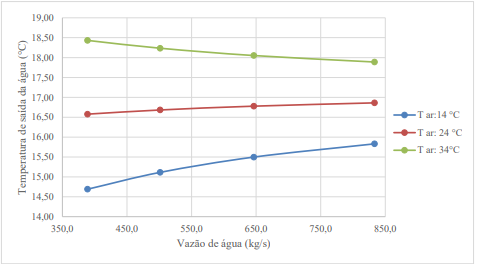
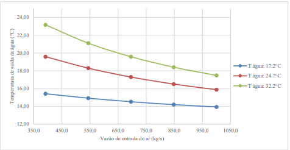
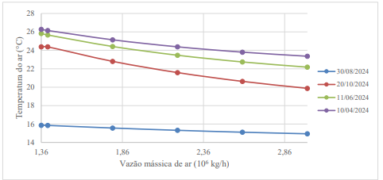
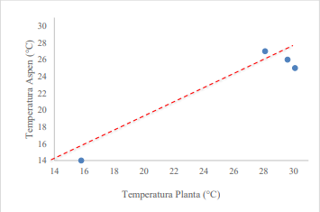
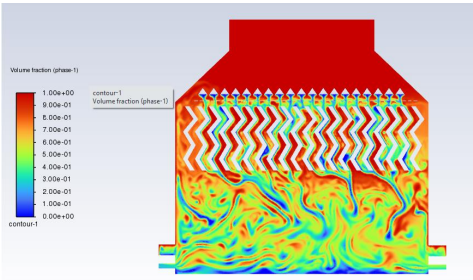

# Análise e Otimização de Torre de Resfriamento

Este repositório contém a documentação e os resultados do meu Trabalho de Conclusão de Curso (TCC) em Engenharia Química. O projeto teve como foco o estudo de desempenho e a proposta de melhorias operacionais em uma torre de resfriamento industrial.

## 🎯 Objetivo
Avaliar a eficiência térmica e hídrica de uma torre de resfriamento e propor otimizações que resultem em economia energética e maior sustentabilidade no processo industrial.

## 🛠 Metodologia e Ferramentas
- **Levantamento de dados:** Coleta de variáveis de operação (temperatura, umidade, vazão).
- **Análise Técnica:** Balanço de massa e energia (cálculo de entalpia e eficiência).
- **Tratamento de Dados:** Organização e análise das variáveis utilizando Excel para modelagem de cenários.

## 💡 Resultados Principais
- **Análise Técnica:** Realizei o balanço de massa e energia para caracterizar o comportamento térmico da torre de resfriamento.
- **Modelagem de Dados:** Através da análise dos dados de entrada (temperatura de bulbo úmido e carga térmica), foi possível mapear as variáveis que mais impactam o rendimento do sistema.
- **Otimização:** O trabalho demonstrou que, ao ajustar as variáveis de operação e a vazão de ar, é possível otimizar a dissipação de calor, garantindo um processo industrial mais estável e eficiente.

### 📈 Resultados da Simulação e Validação

**1. Modelagem Paramétrica**
Abaixo, apresento os resultados das análises paramétricas realizadas no software Aspen Plus, que permitiu o mapeamento das variáveis operacionais do sistema.

*Figura 1: Influência da vazão de água na temperatura de saída sob diferentes condições de temperatura do ar*

*Figura 2: Influência da vazão de ar na temperatura de saída da água sob diferentes condições de temperatura de entrada da água*

**2. Análise de Sensibilidade**
Este estudo focou em observar como a variação da vazão mássica do ar impacta diretamente na temperatura de saída da água, essencial para a otimização energética.

*Figura 3: Análise de sensibilidade da temperatura de saída da água x vazão mássica do ar.*

**3. Validação do Modelo (Gráfico de Paridade)**
Para garantir a confiabilidade dos dados, validamos o modelo teórico comparando os valores simulados no AspenPlus com os dados experimentais.

*Figura 4: Gráfico de paridade da temperatura de saída da água*

**4. Simulação Fluidodinâmica (CFD)**
Por fim, realizamos a simulação em ANSYS CFD para visualizar o escoamento interno e compreender o comportamento do fluido dentro da torre.

*Figura 5: Simulação de escoamento no ANSYS CFD, onde a distribuição da fração volumétrica da fase líquida real no interior da torre de
resfriamento (v = 0,83 m/s).*

*Figura 5: Simulação de escoamento no ANSYS CFD, onde distribuição da fração volumétrica da fase líquida de projeto no interior da
torre de resfriamento (v = 0,46 m/s)*

> **Conclusão Técnica:** A análise conjunta desses gráficos permitiu o mapeamento do rendimento térmico do sistema, sendo a base para as propostas de melhorias operacionais apresentadas no trabalho.
## 📂 Arquivos Disponíveis
- `Entrega Final.pdf`: Documento completo com toda a fundamentação teórica, cálculos e conclusões.

---
*Projeto desenvolvido como requisito para conclusão do curso de Engenharia Química.*
